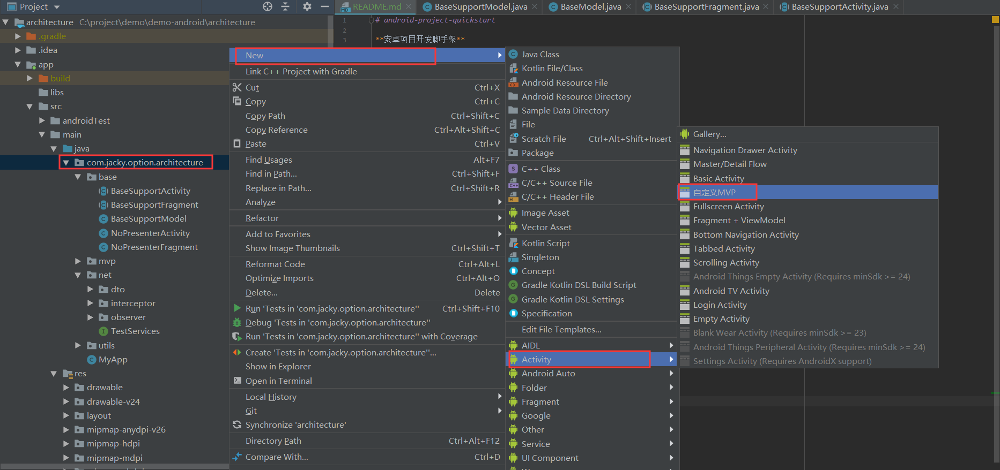

# android-project-quickstart

**安卓项目开发脚手架**

**项目结构**
~~~~
    app: 主工程
    framework：项目框架，mvp模式。与业务无关。
    network: 网络模块，封装了rxjava+retrofit+okhttp。与业务无关。
~~~~

**改造app模块**
~~~~
   根据项目需求，重构自己项目的基类

    app
       com.jacky.option.architecture:
            base：项目基类
                BaseSupportActivity：项目activity的基类
                BaseSupportFragment：项目fragment的基类
                BaseSupportModel：   项目model层的基类
            mvp：模板生成目录
            net：
                dto:网络传输数据
                interceptor:网络拦截器
                observer:网络数据响应观察者
~~~~

## mvp模板的安装
请将 assets目录下的 **MyMVPTemplate**  这个文件夹的存放在如下路径：
* Windows : AS安装目录/plugins/android/lib/templates/activities

* Mac : /Applications/Android Studio.app/Contents/plugins/android/lib/templates/activities

(**请注意是复制整个文件夹, 不是里面的内容!是放在 activities 文件夹里, 不是 gradle-projects 文件夹!!!**)
**最后记得重启 AndroidStudio !**

## mvp模板的使用

